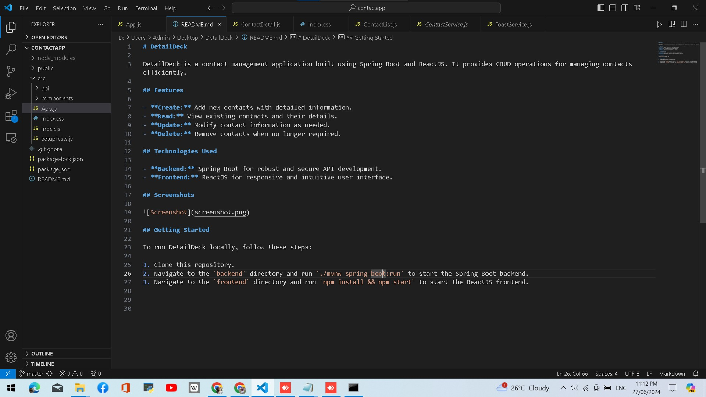

# DetailDeck

DetailDeck is a contact management application built using Spring Boot and ReactJS. It provides CRUD operations for managing contacts efficiently.

## Features

- **Create:** Add new contacts with detailed information.
- **Read:** View existing contacts and their details.
- **Update:** Modify contact information as needed.
- **Delete:** Remove contacts when no longer required.

## Technologies Used

- **Backend:** Spring Boot for robust and secure API development.
- **Frontend:** ReactJS for responsive and intuitive user interface.

## Screenshots

## Getting Started

To run DetailDeck locally, follow these steps:

1. Clone this repository.
2. Navigate to the `backend` directory and run `./mvnw spring-boot:run` to start the Spring Boot backend.
3. Navigate to the `frontend` directory and run `npm install && npm start` to start the ReactJS frontend.

